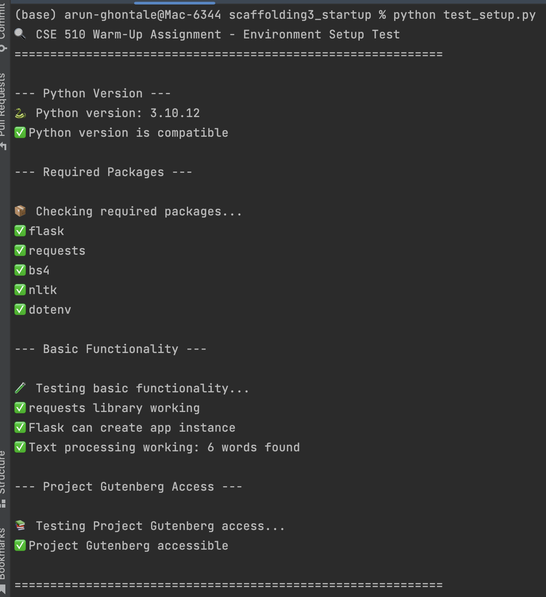
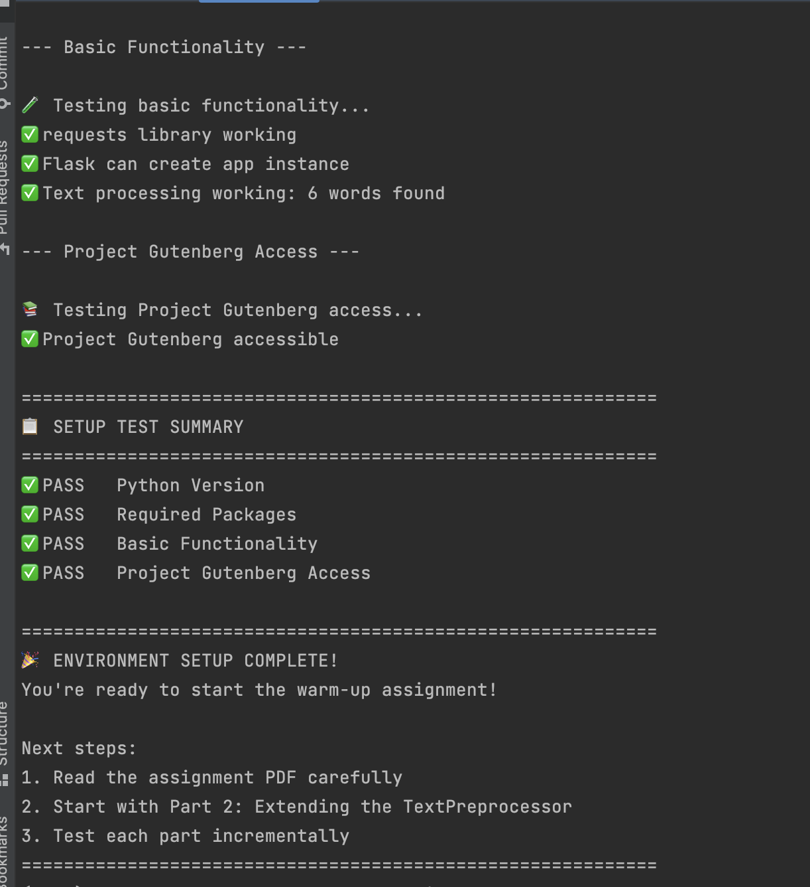

# Gutenberg Text Cleaner — Scaffolding Assignment 3

A Flask-based web service that fetches, cleans, and analyzes plain-text books from Project Gutenberg. Built as part of the Basics of AI (CSE 510) course, Spring 2026.

## What It Does

- Fetches raw text from any Project Gutenberg `.txt` URL
- Strips Gutenberg headers, footers, and table of contents
- Normalizes text (lowercases, removes special characters, standardizes punctuation)
- Calculates statistics: character count, word count, sentence count, average word/sentence length, and top 10 most common words
- Generates a 3-sentence extractive summary from actual story prose
- Serves everything through a clean web interface

## Environment Setup

### 1. Fork and clone the repository

```bash
git clone https://github.com/arun-gg-1996/scaffolding3_startup.git
cd scaffolding3_startup
```

### 2. Install dependencies

```bash
pip install -r requirements.txt
```

### 3. Verify setup

```bash
python test_setup.py
```

All checks should pass before running the app.




### 4. Start the server

```bash
flask --app app run --port 5001 --debug
```

Open your browser to: http://localhost:5001

> Note: Port 5000 is taken by AirPlay on macOS, so we use 5001 instead.

## Project Structure

```
scaffolding3_startup/
├── README.md                  # This file
├── requirements.txt           # Python dependencies
├── test_setup.py              # Environment verification script
├── app.py                     # Flask application with API endpoints
├── starter_preprocess.py      # TextPreprocessor class (fetching, cleaning, stats, summary)
└── templates/
    └── index.html             # Web interface
```

## API Endpoints

| Method | Endpoint        | Description                              |
|--------|-----------------|------------------------------------------|
| GET    | `/`             | Web interface                            |
| GET    | `/health`       | Health check                             |
| POST   | `/api/clean`    | Fetch a Gutenberg URL, clean and analyze |
| POST   | `/api/analyze`  | Analyze raw text directly                |

### Example API Usage

**POST /api/clean**
```json
{
  "url": "https://www.gutenberg.org/files/1342/1342-0.txt"
}
```

**POST /api/analyze**
```json
{
  "text": "Your raw text here..."
}
```

## Screenshots

### Analysis — Pride and Prejudice


### Analysis — Frankenstein


### Analysis — Alice in Wonderland


### Analysis — Moby Dick


## Tested With

- Pride and Prejudice by Jane Austen
- Frankenstein by Mary Shelley
- Alice in Wonderland by Lewis Carroll
- Moby Dick by Herman Melville
